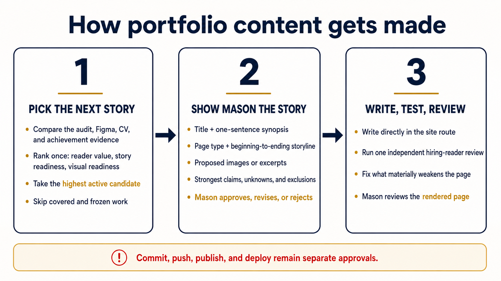

# Mason Portfolio workspace

This private Git repository contains Mason Mitchel's portfolio application,
the source evidence used to check its claims, and a separate archive of retired
work. The deployable application lives in [`site/`](site/).

## Start here

- [`AGENTS.md`](AGENTS.md) — canonical portfolio-content workflow, evidence
  boundaries, approvals, and repository rules.
- [`site/README.md`](site/README.md) — live routes, application structure,
  local commands, and publication state.
- [`private-evidence/deepl-project-candidate-queue.md`](private-evidence/deepl-project-candidate-queue.md)
  — combined GPT-audit, Figma, CV, and achievement ranking. It owns the current
  DeepL work order and frozen or represented dispositions.
- [`private-evidence/deepl-portfolio-current-direction.md`](private-evidence/deepl-portfolio-current-direction.md)
  — current page titles, candidate story direction, writing rules, and homepage
  decisions.
- [`private-evidence/claim-review.md`](private-evidence/claim-review.md) —
  factual limits for every case.
- [`private-evidence/portfolio-asset-manifest.json`](private-evidence/portfolio-asset-manifest.json)
  — source, crop, dimensions, caption, and alternative text for selected
  visuals.
- [`private-evidence/README.md`](private-evidence/README.md) — private evidence
  and source-material index.
- [`archive/README.md`](archive/README.md) — index of retired code, old reviews,
  completed research, and historical snapshots.

## Portfolio content workflow



This image is a quick reference, not a second policy owner. The repository-root
[`AGENTS.md`](AGENTS.md) owns the workflow; the candidate queue owns ranking and
work status.

## Repository layout

| Path | Purpose |
| --- | --- |
| [`site/`](site/) | The only deployable portfolio source. |
| [`private-evidence/`](private-evidence/) | Current private decision owners, claim review, evidence maps, and source exports. |
| [`docs/`](docs/) | Current repository-wide operating guidance. |
| [`archive/`](archive/) | Preserved history that is not current product or claim truth. |
| `tmp/` | Ignored scratch space. Nothing here is a deliverable or source of truth. |

The repository root intentionally contains no loose exports, screenshots,
videos, PDFs, review packets, or working folders.

## Checks

Run the repository check from this directory:

```bash
node scripts/check-repository.mjs
```

Run application checks from `site/`:

```bash
./node_modules/.bin/eslint . --ignore-pattern dist --ignore-pattern .next
WRANGLER_LOG_PATH=.wrangler/wrangler.log ./node_modules/.bin/vinext build
node --test tests/rendered-html.test.mjs
```

Then run the final whitespace check from this directory:

```bash
git diff --check
```

## Source control and deployment

Private evidence is tracked so the complete working context can be recovered on
another machine. The repository must remain private. A commit or push is only a
source-control checkpoint; it does not publish or deploy the site.

Mason controls the final wording, source selection, repository access, and
deployment. Unsupported claims are omitted from the site instead of explained
with a public disclaimer.

Evidence rules protect factual integrity; they do not determine case-study
structure or prose. A story spec or passing test suite remains provisional
until the complete page works for a first-time hiring reader.
