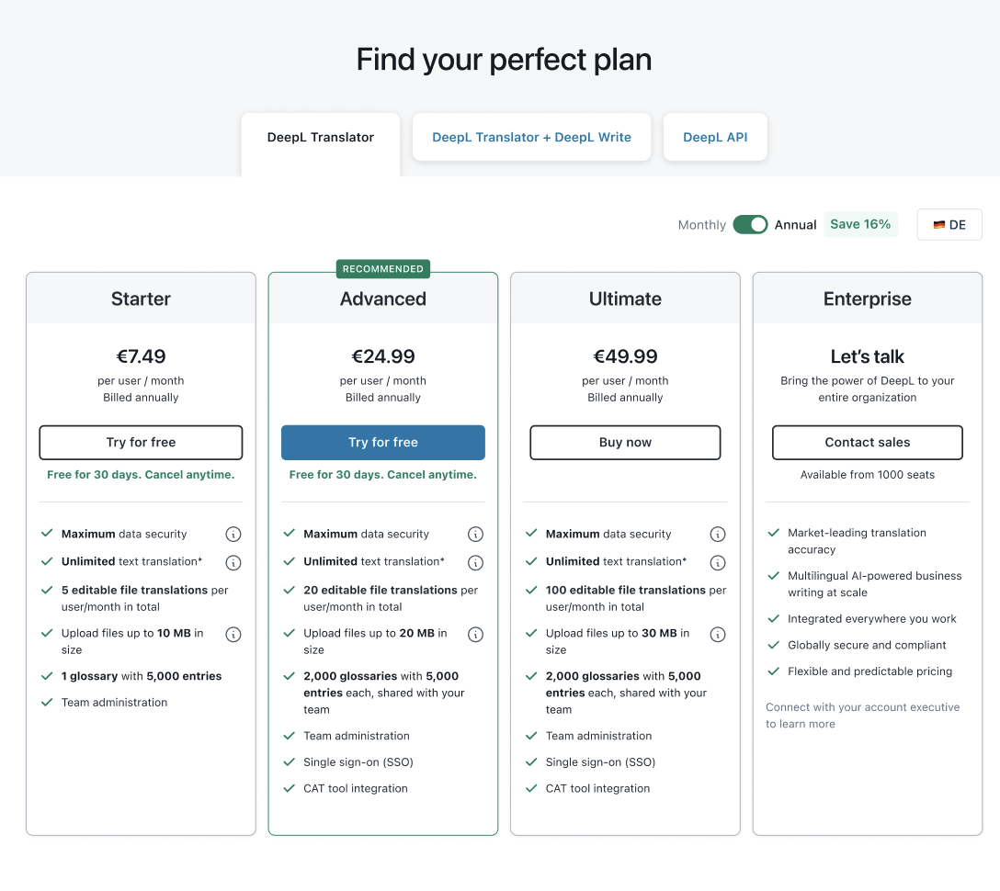
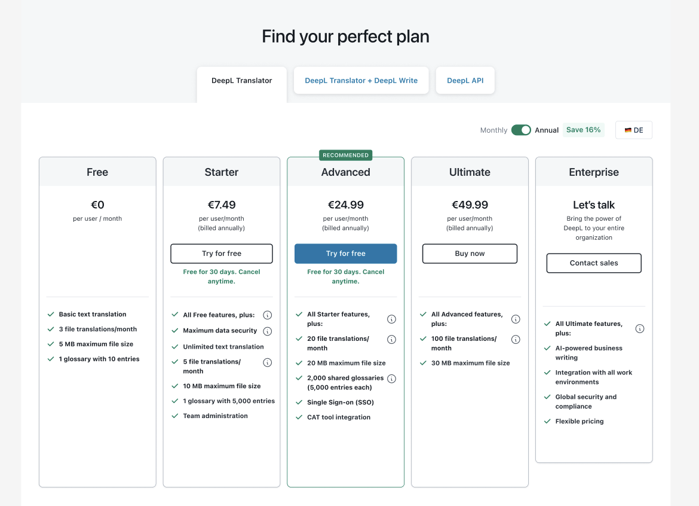

# Cutting the pricing grid down to what changes

Status: Rejected by Mason on 2026-07-27; preserved only as failed draft history

Drafted: 2026-07-26

Revised: 2026-07-27

Public use: Prohibited

Mason rejected the narrative after beginning his read. Its prose, headings,
ending, lifecycle framing, and claimed reader-gate result are not approved and
must not be reused as a base for revision. The preserved text below records the
failed candidate exactly enough to diagnose what went wrong.

This is a private writing candidate, not a public story specification or an
implementation brief. It uses the connected June-July 2024 `MON-06` working
sequence. It does not unfreeze the rejected public story, the site, or any
asset.

## Candidate narrative

A pricing grid should make one decision legible: what changes when someone
moves up a plan? In June-July 2024, Write Pro had added another product
relationship to DeepL's wider pricing page, but the Translator grid still had
to answer that basic question. Its paid cards repeated inherited benefits,
leaving plan-specific limits inside longer lists.

I helped reshape a working proposal for that grid. The sequence preserved here
shows the plan cards, not the detailed comparison table beneath them. My intent
was to give those two layers different jobs: let the grid summarize what
changes from tier to tier, and let the table carry the fuller inventory.

*Working proposal — repeated paid-tier lists. Starter, Advanced, and Ultimate
repeat security and unlimited translation before mixing in the limits that
change by plan.*

The work required editing as well as hierarchy. I helped set goals for shorter,
more consistent benefit wording, distinct benefits, and retained
team-administration detail. Across the connected working states, visible
changes included:

- `5 editable file translations per user/month in total` becoming
  `5 file translations/month`;
- `Upload files up to 10 MB in size` becoming `10 MB maximum file size`; and
- `2,000 glossaries with 5,000 entries each, shared with your team` becoming
  `2,000 shared glossaries (5,000 entries each)`.

Those reductions made the units shorter, but they were not free of risk.
`5 file translations/month`, for example, drops `editable` and `per user` from
the earlier line. In a production pass, I would recheck every removed qualifier
against the detailed table and plan terms rather than treat brevity as an
automatic win.

When the cumulative logic disappeared in the next layout, I called it out and
asked for `All previous-plan features, plus` to return. The revised state made
inheritance explicit: Starter carried Free, Advanced carried Starter, Ultimate
carried Advanced, and Enterprise carried Ultimate.

The revision also added a Free card and changed some Enterprise content. I use
the pair to compare the paid-tier content pattern rather than the whole layout:
repeated shared benefits became a heading that pointed back, followed by a
shorter list of additions.

*Revised working proposal — cumulative paid tiers. The state adds Free; across
the paid plans, each card names what it inherits before listing the limits or
capabilities that change.*

This remained a working proposal rather than a shipped result. It also made a
residual question easier to see: Ultimate was roughly twice the Advanced price
but showed only two added lines. That would need validation before assuming the
leaner card communicated enough incremental value.

The judgment I would carry forward is to make each layer earn its space: put
the next-plan decision on the card, keep exhaustive detail in the comparison
table, and recheck every removed qualifier against the promise the product must
still make.

## Evidence sequence

1. Open with the plan-comparison decision. Keep Write to one clause of wider
   pricing-page context.
2. Show the clean repeated-list proposal and name the grid-versus-table intent.
3. Use two or three visible copy changes to show Mason's collaborative editing,
   including the qualifier risk created by shortening.
4. Put Mason's cumulative-heading correction directly before the revised
   working state.
5. Disclose that the revised state also adds Free and changes Enterprise.
   Direct the visual comparison to the paid-tier content pattern.
6. End with the working-proposal lifecycle, the sparse Ultimate-card validation
   question, and the content judgment the sequence demonstrates.

### Primary evidence records

| Sequence role | Private source | What it establishes | Candidate caption and text alternative | Current gate |
| --- | --- | --- | --- | --- |
| Repeated-list working state | [`file-tWhO0PSkFda3Tfh3Hi24u5rQ.png`](../../../private-evidence/projects/pricing-evolution/gpt-export-evidence/attachments/file-tWhO0PSkFda3Tfh3Hi24u5rQ.png), 1088 x 970, SHA-256 `170ebcb6f3d3b4a2445ae1ff8de229ee3113229905408b40dd39f9529d78507a` | A July 1, 2024 paid-tier Translator layout shared for revision in the connected workshop. Starter, Advanced, and Ultimate repeat shared benefits before mixing in plan-specific limits. | Caption: `Shared benefits recur across the paid cards, leaving the plan differences inside longer lists.` Alt: `Working Translator pricing layout with Starter, Advanced, Ultimate, and Enterprise cards repeating shared benefits before listing plan-specific limits.` | Hash-verified historical working artifact. Private and unapproved for publication. |
| Revised cumulative working state | [`file-bkypvx2q2LfL56qYugZ3wwbK.png`](../../../private-evidence/projects/pricing-evolution/gpt-export-evidence/attachments/file-bkypvx2q2LfL56qYugZ3wwbK.png), 1170 x 846, SHA-256 `1eb12932ab9f74f8835e59084690c9ac2d8397c349fd9a40c26a1309e7399801` | The revised July 1, 2024 state shared after Mason asked why the cumulative headings were missing. It adds Free and changes Enterprise as well as making the paid-tier inheritance pattern explicit, so it is not a one-variable comparison. | Caption: `The state adds Free; across the paid plans, each card names what it inherits before listing what changes.` Alt: `Revised five-tier Translator pricing layout with a new Free card and cumulative paid-tier headings such as All Starter features, plus.` | Hash-verified historical working artifact. Private and unapproved for publication. |

The two images are byte-for-byte curated copies of the recovered working
attachments, not 2026 portfolio reconstructions. They form a connected proposal
sequence, not a controlled one-variable or production before-and-after. The
visual comparison is limited to the paid-tier content pattern. No personal data
is visible in the pair, but no asset is export-ready because publication
permission has not been approved.

## Private evidence and claim controls

- **Artifact:** Four hash-verified images and the connected workshop record
  establish a genuine same-product, same-plan-family working sequence. Only the
  two clean images above are selected for this draft.
- **Contribution:** Mason's account and direct messages support his
  collaborative conception, direction, writing, editing, application, and
  explicit cumulative-heading correction.
- **Authorship:** Do not attribute every visible line verbatim to Mason or turn
  collaborative workshop output into sole authorship or ownership.
- **Lifecycle:** Working proposal only. Approval, production use, shipment, and
  later adoption are not established.
- **Outcome:** No usability, behavior, conversion, revenue, or other measured
  result is established.
- **Permission:** The curated attachments and this draft remain private and
  unapproved for publication.

## Deliberate omissions

- Keep the red hand-annotated June image out of the narrative and any public
  sequence at Mason's direction.
- Keep the earlier five-tier cumulative image
  `file-ivKHtgzlEG5d1YUtkUPix1ZF.png` as private reserve rather than adding a
  third visual that repeats the ending.
- Use Write only for the opening pressure and context. Do not turn the Write
  Pro launch material into a second case.
- Omit Voice, API, Pricing Page V2, naming-system work, checkout work, later
  public pricing states, and the 2026 pricing reconstructions.
- The focused structural repair passed its private narrative reader gate. This
  does not approve the public title, story specification, site, assets, or
  publication; Step 25 has not started.
